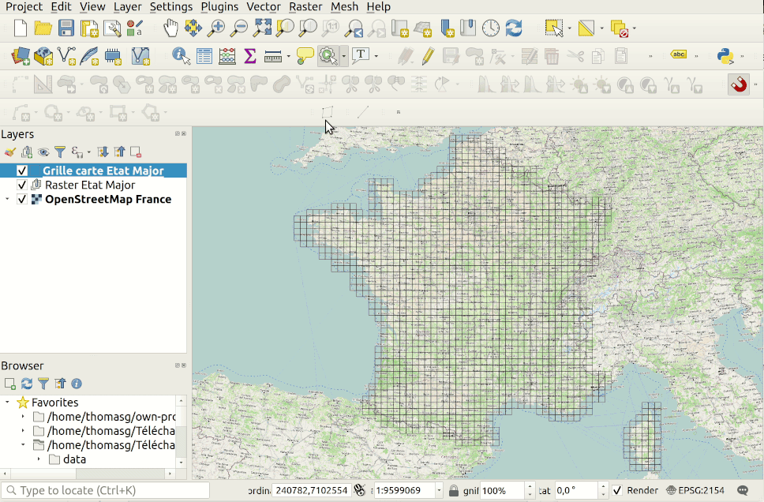
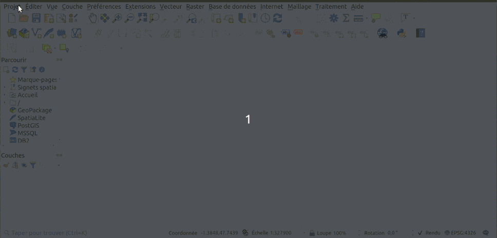
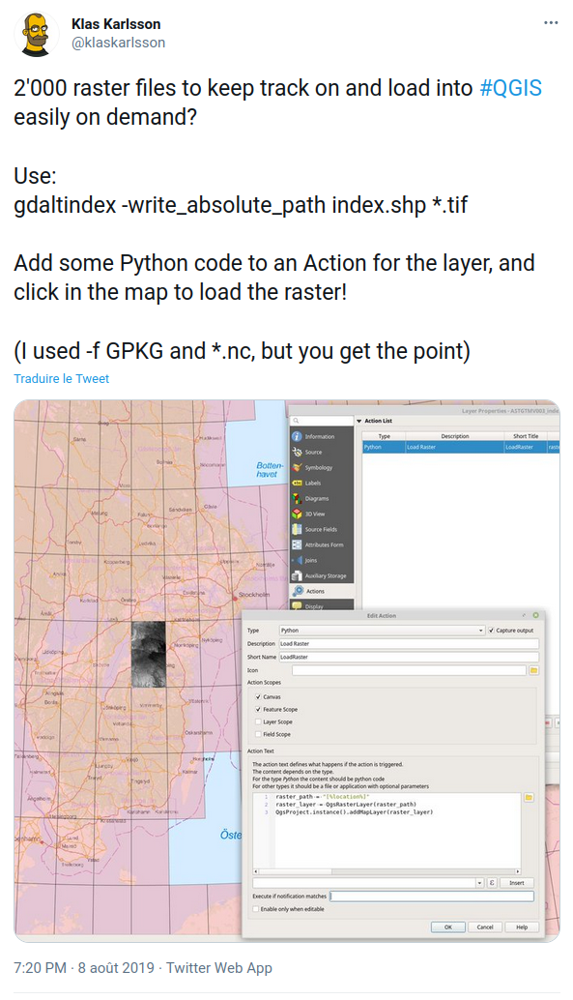

# QGIS as a download service

## Purpose

The idea is to be able to consume data from https://geoservices.ign.fr/documentation/diffusion/index.html using extent instead of downloading massive files for small areas. 
You are able to download from click using action or from native selection drawing tools. 
Indirectly, you can select now using native "Select by Location" in processing toolbox 
to select from vector layers intersecting the grid.

For the moment, we only have a demo using raster from the French "Carte d'État Major" (1820-1866). As they are delivered by "tiles", we created a grid. You can from this grid, click on each "tile", download file and add it in one step. We use QGIS actions for this intend.

See the process in action in below demo



## How to use it

* Download project as a ZIP https://github.com/ThomasG77/qgis-as-a-download-service/archive/main.zip
* Open the file `carte-etat-major.qgz` and uncompress
* Click on the layer "Grille Carte Etat Major"
* Option 1: Select the tool "Run feature action" or "Exécute l'action d'entité" for French people, click on a tile from the grid. It will download it (in data directory) and add it. If existing in data, it will add it if not already in the group.
* Option 2: Use the qgis native selection tool and push on the button for downloading (see demo below)



In this case, be aware that we do not run the task behind the scene ("queuing") so you may freeze QGIS if you download a large area


## Want to download all? Don't abuse and take another road with below recipe

Be kind as we host the data on our own server. So if you want the full data, you should better use URLs from files `files_40k.txt` (all France) and `files_10k.txt` (only Paris and around called "Ile de France". Both files are list of files from section "Carte d'État Major" from https://geoservices.ign.fr/documentation/diffusion/index.html

In this case, something like `wget -c -i files_40k.txt` will do the job.

You may also use our script `download.sh` that do download, extract and do some other operations.

## Credits

Mainly based on idea from Klas Karlsson (see below) but to ease OpenData consumption for GIS users

<a href="https://twitter.com/klaskarlsson/status/1159514845127028738"></a>

Data for SRTM 30m grid

```
wget https://dwtkns.com/srtm30m/srtm30m_bounding_boxes.json
```

